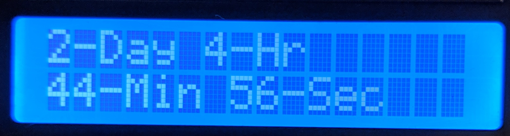

# countdown
  
This sketch uses Google's time servers to get an epoch timestamp. It is then subtracted from a timestamp provided by the user. The result, is the number of seconds remaining to the user's epoch timestamp. The seconds are converted into days, hours, minutes and seconds.  
## Usage
Fill in the `SSID` and `password ` sections of the scetch. In `NTPClient timeClient(ntpUDP, "time.google.com", 3600, 60000);`, `3600` means that the time (zulu time), is offset by one hour (GMT+1). Adjust this to your timezone or adjust the timestamp you put in (never both). For converting to a timestamp, I recommend [This website](https://www.epochconverter.com/).
